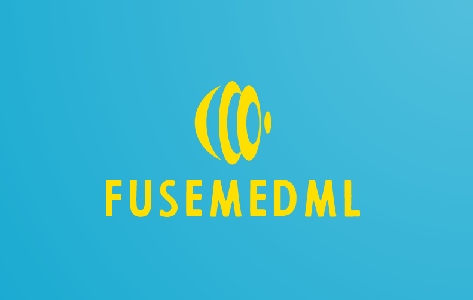

[](https://opensource.org/)
[](https://badge.fury.io/py/fuse-med-ml)
[](https://join.slack.com/t/fusemedml/shared_invite/zt-xr1jaj29-h7IMsSc0Lq4qpVNxW97Phw)
[](https://pepy.tech/project/fuse-med-ml)



# Effective Code Reuse across ML projects!
## Battle tested in the medical domain:  
Medical imaging, molecular biochem and EHR clinical data analysis

[Skip to install instructions](#Installation)

# Motivation - *"*Oh, the pain!*"*
Analyzing **many** ML research projects we discovered that 
* Projects bring up is taking **far too long**, even when very similar projects were already done in the past by the same lab!
* Porting individual components across projects was *painful* - resulting in **"reinventing the wheel" time after time**

# How the magic happens

## 1. A simple yet super effective design concept
### Data is kept in a nested (heirarichal) dictionary - [NDict](https://github.com/IBM/fuse-med-ml/blob/master/fuse/utils/ndict.py)
This is very flexible and allows to easily deal with multi modality information. 
```python
sample_ndict = NDict()
sample_ndict['input.mri'] = # ...
sample_ndict['input.ct_view_a'] = # ...
sample_ndict['input.ct_view_b'] = # ...
sample_ndict['groundtruth.disease_level_label'] = # ...
```
### Components are written in a way that allows to define input and output keys, to be read and written from the nested dict
Examples:

A data pipeline operator
```python
class OpPad(OpBase):
    def __call__(self, sample_dict: NDict, 
        key_in: str, 
        padding: List[int], fill: int = 0, mode: str = 'constant',
        key_out:Optional[str]=None,
        ):

        #we extract the element in the defined key location (for example 'input.xray_img')
        img = sample_dict[key_in] 
        assert isinstance(img, np.ndarray), f'Expected np.ndarray but got {type(img)}'
        processed_img = np.pad(img, pad_width=padding, mode=mode, constant_values=fill)         
        
        #store the result in the requested output key (or in key_in if no key_out is provided)
        key_out = key_in if key_out is None
        sample_dict[key] = processed_img 

        #returned the modified nested dict
        return sample_dict
```

Since the key location isn't hardcoded, this module can be eaily reused across different research projects with very different data sample structures. More code reuse - Hooray!  
  
Another example: [TODO: add examples from evaluator, loss and/or additional]   

## 2. "Batteries included" key components, built using the same design concept

### **fuse.data** - A **declarative** super flexible data processing pipeline
* Easy dealing with complex multi modality scenario
* Advanced caching, including periodic audits to automatically detect stale caches
* [More Details](https://github.com/IBM/fuse-med-ml/tree/master/fuse/data/README.md) 
  
### **fuse.eval** - a standalone library for **evaluating ML models** (not necessarily trained with FuseMedML)  
The package includes collection of off-the-shelf metrics and utilities such as **statistical significance tests, calibration, thresholding, model comparison** and more. More details can be found [here](https://github.com/IBM/fuse-med-ml/tree/master/fuse/eval/README.md)  

## Supported DL libraries
Some components depend on pytorch. For example, ```fuse.data``` is oriented towards pytorch DataSet, DataLoader, DataSampler etc.
```fuse.dl``` makes heavy usage of pytorch models.
Some components do not depend on any specific DL library - for example ```fuse.eval```.

Broadly speaking, the supported DL libraries are:
* "Pure" [pytorch](https://pytorch.org/)
* [pytorch-lightning](https://www.pytorchlightning.ai/)

Before you ask - **pytorch-lightning and FuseMedML play along very nicely and have in practice orthogonal and additive benefits :)**  
See [Example-TODO insert link](...) for simple supervised learning cases, and [Example-TODO insert link](...) for completely custom usage of pytorch-lightning and FuseMedML.

## Domain Extensions
fuse-med-ml, the core library, is completely domain agnostic!
Domain extensions are optionally installable packages that deal with specific (sub) domains. For example:

* **fuseimg** which was battletested in many medical imaging related projects (different organs, imaging modalities, tasks, etc.)
* **fusedrug** which focuses on molecular biology and chemistry - prediction, generation and more

Domain extensions contain concrete implementation of components and components parts within the relevant domain, for example:  
* Data pipeline operations - for example, a 3d affine transformation of a 3d image
* Evaluation metrics - for example, a custom metric evaluating docking of a potential drug with a protein target
* Loss functions - for example, a custom segmentation evaluation loss

You are highly encouraged to create additional domain extensions and/or contribute to the existing ones :)
There's no need to wait for any approval, you can create domain extensions on your own repos right away
Read more about how to create domain extensions **here [TODO: add a link and an actual guide]**
 

# Installation
The best way to install `FuseMedML` is to clone the repository and install it in an editable mode using `pip`:
```bash
$ pip install -e .
```
This mode, allows to edit the source code and easily contribute back to the open-source project.

In this mode  you can also install and run our end to end examples using:
```bash
$ pip install -e examples
```
An alternative, is to simply install using PyPI 
```bash
$ pip install fuse-med-ml
```
 
 FuseMedML supports Python 3.7 or later and PyTorch 1.5 or later. A full list of dependencies can be found in [**requirements.txt**](https://github.com/IBM/fuse-med-ml/tree/master/requirements.txt).
 

# FuseMedML from the ground up
[**User Guide**](https://github.com/IBM/fuse-med-ml/tree/master/fuse/doc/user_guide.md) - including detailed explanation about FuseMedML modules, structure, concept, and more.

[**Hello World**](https://colab.research.google.com/github/IBM/fuse-med-ml/blob/master/fuse_examples/imaging/hello_world/hello_world.ipynb) - Introductory hands-on notebook on the well-known MNIST dataset. 

[**High Level Code Example**](https://github.com/IBM/fuse-med-ml/tree/master/fuse/doc/high_level_example.md) - example of binary classifier for mammography with an auxiliary segmentation loss and clinical data

## Examples
* classification
    * [**MNIST**](https://github.com/IBM/fuse-med-ml/tree/master/examples/fuse_examples/imaging/classification/mnist/)  - a simple example, including training, inference and evaluation over [MNIST dataset](http://yann.lecun.com/exdb/mnist/)
    * [**KNIGHT Challenge**](https://github.com/IBM/fuse-med-ml/tree/master/examples/fuse_examples/imaging/classification/knight) - preoperative prediction of risk class for patients with renal masses identified in clinical Computed Tomography (CT) imaging of the kidneys. Including data pre-processing, baseline implementation and evaluation pipeline for the challenge.
    * [**Multimodality tutorial**](https://github.com/IBM/fuse-med-ml/blob/master/examples/fuse_examples/multimodality/image_clinical/multimodality_image_clinical.ipynb) - demonstration of two popular simple methods integrating imaging and clinical data (tabular) using FuseMedML  
    * [**Skin Lesion**](https://github.com/IBM/fuse-med-ml/tree/master/examples/fuse_examples/imaging/classification/skin_lesion/) - skin lesion classification , including training, inference and evaluation over the public dataset introduced in [ISIC challenge](https://challenge.isic-archive.com/landing/2017)
    * [**Prostate Gleason Classification**](https://github.com/IBM/fuse-med-ml/tree/master/example/fuse_examples/imaging/classification/prostate_x/) - lesions classification of Gleason score in prostate over the public dataset introduced in [SPIE-AAPM-NCI PROSTATEx challenge](https://wiki.cancerimagingarchive.net/display/Public/SPIE-AAPM-NCI+PROSTATEx+Challenges#23691656d4622c5ad5884bdb876d6d441994da38)
    * [**Lesion Stage Classification**](https://github.com/IBM/fuse-med-ml/tree/master/examples/fuse_examples/imaging/classification/duke_breast_cancer/) - lesions classification of Tumor Stage (Size) in breast MRI over the public dataset introduced in [Dynamic contrast-enhanced magnetic resonance images of breast cancer patients with tumor locations (Duke-Breast-Cancer-MRI)](https://wiki.cancerimagingarchive.net/pages/viewpage.action?pageId=70226903)
    * [**Breast Cancer Lesion Classification**](https://github.com/IBM/fuse-med-ml/tree/master/examples/fuse_examples/imaging/classification/MG_CMMD) - lesions classification of tumor ( benign, malignant) in breast mammography over the public dataset introduced in [The Chinese Mammography Database (CMMD)](https://wiki.cancerimagingarchive.net/pages/viewpage.action?pageId=70230508)
    
## Walkthrough template
* [**Walkthrough Template**](https://github.com/IBM/fuse-med-ml/tree/master/fuse/templates/walkthrough_template.py) - includes several TODO notes, marking the minimal scope of code required to get your pipeline up and running. The template also includes useful explanations and tips.

## Evaluation package
 


## Community support
We use the Slack workspace at fusemedml.slack.com for informal communication.
We encourage you to ask questions regarding FuseMedML that don't necessarily merit opening an issue on Github.

[**Use this invite link to join FuseMedML on Slack**](https://join.slack.com/t/fusemedml/shared_invite/zt-xr1jaj29-h7IMsSc0Lq4qpVNxW97Phw).

IBMers can also join a Slack channel in the IBM Research organization: 
[**#fusers**](https://ibm-research.slack.com/archives/C0176S37QNP) .

# Citation
If you use FuseMedML in scientific context, please consider citing us:
```bibtex
@misc{https://doi.org/10.5281/zenodo.5146491,
  doi = {10.5281/ZENODO.5146491},
  url = {https://zenodo.org/record/5146491},
  author = {IBM Research,  Haifa},
  title = {FuseMedML: https://github.com/IBM/fuse-med-ml},
  publisher = {Zenodo},
  year = {2021},
  copyright = {Apache License 2.0}
}
```

