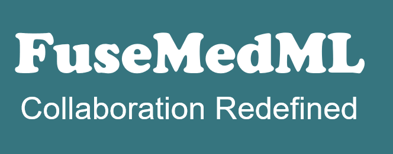

[](https://opensource.org/)
[](https://badge.fury.io/py/fuse-med-ml)
[](https://join.slack.com/t/newworkspace-i3g4445/shared_invite/zt-sr0hcb9f-E~SLYbG9bE5fn8iq5OE0ww)



# What is FuseMedML?
FuseMedML is an open-source PyTorch-based framework designed to **enhance collaboration, facilitate deep learning R&D and share expertise in medical imaging and Multimodal data**.
# Why use FuseMedML?
Successful deep learning R&D must rely on knowledge and experiments, accumulated over a wide variety of projects, and developed by different people and teams.

FuseMedML is an outstanding collaboration framework that allows you to rerun an experiment or reuse some of the capabilities originally written for different projects—all with minimal effort.\
Using FuseMedML, you can write generic components that can be easily shared between projects in a plug & play manner, making sharing and collaboration easier than ever before.

The framework’s unique software design provides many advantages, making it an ideal framework for deep-learning research and development in medical imaging:

* **Rapid development** -

  With just minimal code implementation, you can get a fully-featured pipeline up and running, including caching, augmentation, monitoring, logging, and more. A common generic implementation is provided for most components in the pipeline and all you need to do is implement specific components such as data extractors.
* **Flexible, customizable, and scalable** -

  The default implementation of modules and components suits many common cases. If needed,  thanks to the fact that the components in the pipeline are decoupled, you can re-implement any component to achieve the required behavior.
* **Encourage sharing and collaboration** - 

  Using FuseMedML, you will be able to write/use generic components that are decoupled from other components, the structure of the data, and the model output. These kinds of components can help drive powerful sharing and collaboration.
* **Collection of common, easy to use, generic components and capabilities** - 

  FuseMedML comes with a large collection of components that grow with each new project.
  Examples include: Monitoring, crash recovery, caching, augmentation, visualization, data sampling/balancing, metrics, losses, multi-tasking, multi-modalities, multi-processing, etc.
* **Standardized evaluation** - 

  All evaluation methods and code are completely shared and in that way contribute to a standardized evaluation.
* **Medical imaging expertise** - 

  The pre-implemented components were created by a group of medical-imaging researchers, specifically to tackle many of the challenges in this field.
* **Compatibility with alternative frameworks**

  FuseMedML is compatible with most code components developed in alternative frameworks.\
  You can also use many other popular GitHub projects in complement with FuseMedML, such as Git repository that includes a PyTorch model.
# Citation
If you use FuseMedML in scientific context, please consider citing us:
```bibtex
@misc{https://doi.org/10.5281/zenodo.5146491,
  doi = {10.5281/ZENODO.5146491},
  url = {https://zenodo.org/record/5146491},
  author = {IBM Research,  Haifa},
  title = {FuseMedML: https://github.com/IBM/fuse-med-ml},
  publisher = {Zenodo},
  year = {2021},
  copyright = {Apache License 2.0}
}
```
# Installation
The best way to install `FuseMedML` is using `pip`:
```bash
$ pip install fuse-med-ml
```
 FuseMedML supports Python 3.6 or later and PyTorch 1.5 or later. A full list of dependencies can be found in [**requirements.txt**](https://github.com/IBM/fuse-med-ml/tree/master/requirements.txt).
 
An alternative, allowing to edit the source code, would be to download the repo and install it using:
```bash
$ pip install -e .
```

# Ready to get started?
## FuseMedML from the ground up
[**User Guide**](https://github.com/IBM/fuse-med-ml/tree/master/fuse/doc/user_guide.md) - including detailed explanation about FuseMedML modules, structure, concept, and more.

[**High Level Code Example**](https://github.com/IBM/fuse-med-ml/tree/master/fuse/doc/high_level_example.md) - example of binary classifier for mammography with an auxiliary segmentation loss and clinical data

## Examples
* classification
    * [**MNIST**](https://github.com/IBM/fuse-med-ml/tree/master/fuse_examples/classification/mnist/)  - a simple example, including training, inference and evaluation over [MNIST dataset](http://yann.lecun.com/exdb/mnist/)
    * [**Skin Lesion**](https://github.com/IBM/fuse-med-ml/tree/master/fuse_examples/classification/skin_lesion/) - skin lesion classification , including training, inference and evaluation over the public dataset introduced in [ISIC challenge](https://challenge.isic-archive.com/landing/2017)
    * [**Prostate Gleason Classifiaction**](https://github.com/IBM/fuse-med-ml/tree/master/fuse_examples/classification/prostate_x/) - lesions classification of Gleason score in prostate over the public dataset introduced in [SPIE-AAPM-NCI PROSTATEx challenge](https://wiki.cancerimagingarchive.net/display/Public/SPIE-AAPM-NCI+PROSTATEx+Challenges#23691656d4622c5ad5884bdb876d6d441994da38)

## Walkthrough template
* [**Walkthrough Template**](https://github.com/IBM/fuse-med-ml/tree/master/fuse/templates/walkthrough_template.py) - includes several TODO notes, marking the minimal scope of code required to get your pipeline up and running. The template also includes useful explanations and tips.

## Community support
We use the Slack workspace at fusemedml.slack.com for informal communication.
We encourage you to ask questions regarding FuseMedML that don't necessarily merit opening an issue on Github.

[**Use this invite link to join FuseMedML on Slack**](https://join.slack.com/t/newworkspace-i3g4445/shared_invite/zt-sr0hcb9f-E~SLYbG9bE5fn8iq5OE0ww).

IBMers can also join a Slack channel in the IBM Research organization: 
[**#fusers**](https://ibm-research.slack.com/archives/C0176S37QNP) .


