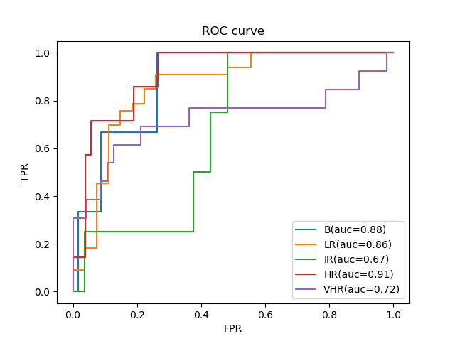

# Task 2 - risk categories classification
AUC: 0.808 [0.726-0.881]
## Multi-Class AUC

| AUC | AUC-BVsRest | AUC-LRVsRest | AUC-IRVsRest | AUC-HRVsRest | AUC-VHRVsRest |
| ------ | ------ | ------ | ------ | ------ | ------ |
| 0.808 [0.726-0.881] | 0.877 [0.725-0.982] | 0.857 [0.754-0.944] | 0.670 [0.473-0.875] | 0.911 [0.819-0.981] | 0.723 [0.512-0.900] |
## ROC Curve
 

 
