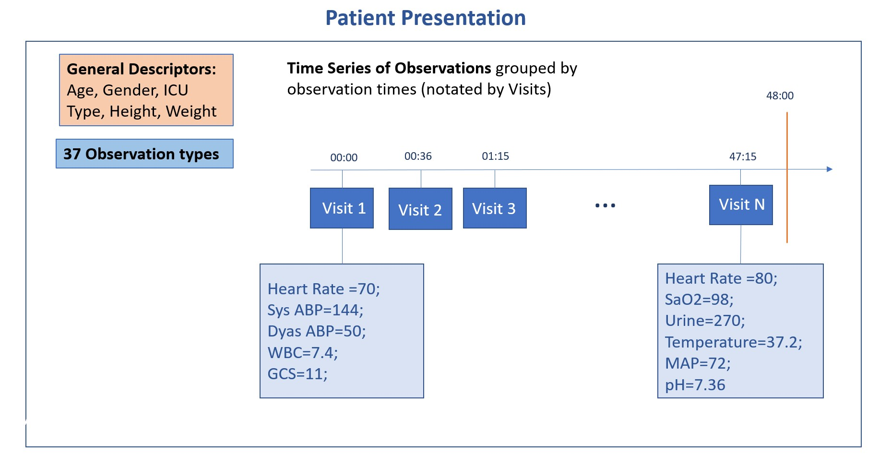
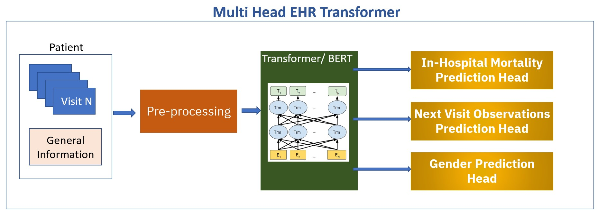

# Predicting Mortality of ICU Patients with Fuse-Med-ML

## Introduction

The aim of this example is to demonstrate Fuse-Med-ML abilities for prediction tasks involving Electronic Health Records (EHR).  In this example, Fuse will be applied for the prediction of In-hospital patients’ mortality after spending 48 hours in Intensive Care Unit. 

 

## Dataset
The dataset used in the example was taken from the PhysioNet Computing in Cardiology Challenge that was held in 2012 (https://physionet.org/content/challenge-2012/1.0.0/). The challenge data was extracted from MIMICC II Clinical Database. We used EHR records of 8000 patients that are available for public access in the above link. More details on the dataset can be found at https://ieeexplore.ieee.org/abstract/document/6420376

 

## Task and Modeling 
In this example, we will see Fuse-Med-ML applied to the prediction of in-hospital mortality, which is one of the tasks that was included in the PhysioNet challenge. 

Figure 1 presents the structure of patient data in this data set. It can be seen that patients presented with both general information and time series of observations during the first 48 hours in the hospital. The architecture can be seen in Figure 2. We used a transformer-based deep-learning model that utilizes the BERT network design with additional adjustments.

 

<figure>
  
  <figcaption>Figure 1</figcaption>
</figure>

 

The network was implemented in a manner that allows several output ”heads”, each responsible for a separate task. The network consists of several encoder layers, followed by task-specific heads (smaller neural network classifiers). 

 

<figure>
  
  <figcaption>Figure 2</figcaption>
</figure>

 

The patients’ data is passing a set of preprocessing steps before entering the modeling stage, which includes the exclusion of illegal patients, mapping continuous values of observation to categorical values by applying digitization, and combining both static data (general information) and time series in one input patient trajectory sequence. 

As mentioned, the network has multiple prediction heads, related to multiple prediction tasks. Using multiple heads aims to improve patients' representation.  We trained and tested multiple networks consisting of a combination of the following tasks:

  - **Next Visit Prediction** A multi-label classification task of predicting the observation values that will appear in the visit following the last visit of the trajectory.
 - **Gender Prediction**: A binary classifier that predicts the biologically determined gender of the
patient.
 - **In-hospital mortality** prediction: A binary classifier that predicts will patient die or not during his hospital stay after the first 48 hours.

 

## Usage Instructions
Download the following data to a designated folder in your system:
-	set-a and set-b folders of the patient’s input
-	Outcome-a.txt, Outcome-b.txt files 

In the configuration file config.yaml hydra file:
1.	Define environment variable CINC_DATA_PATH to the data folder. 
2.	There is a possibility to define an environment variable CINC_DATA_PKL of a path to the pickle file that will manage the loaded data for the next runs. Use 'null' (that is the default) in configuration if you are not using this option
3.	Configure network hyperparameters

Run:  python3 main_train.py

