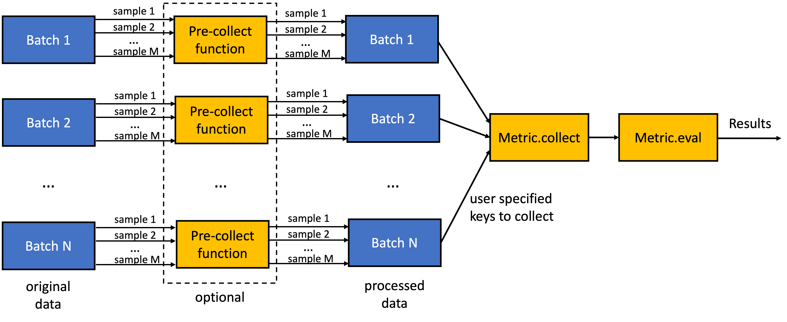

# FuseMedML Evaluation Package

## Introduction
The evaluation package of FuseMedML (fuse.eval) is a standalone library for evaluating ML models for various performance metrics and comparing between models.

[skip to examples](#examples) | [skip to design structure](#structure)

## What's inside?
Besides having implemented a rich library of evaluation metrics and helper functions, fuse.eval offers many higher level features that can save you lots of time during your ML research:
* **Handling massive data.** What if you want to compute a metric over millions of samples that cannot be read to RAM all at once? fuse.eval takes care of the batching and multiprocessing to make it happen.
* **Multi-class evaluation.** Some metrics naturally extend from binary to multi-class, and in others it may be less straightforward. In fuse.eval, a "one vs. rest" logic is implemented under the hood. This means that whenever you implement your own new metrics, you automatically also get the "one vs. rest" computation without writing any extra code.
* **Statistical significance**. fuse.eval can easily compute confidence intervals and compare models (via paired bootstrap test, Delong's test, McNemar's test).
* **Pipelining.** You can easily combine a sequence of metrics, as well as interleave metrics with more general operations on the data. Each metric or operation may use results of previously computed metrics or operations.
* **Automatic per-fold evaluation** and sub-group analysis.

## Design principles
* **Generic input.** Input data for evaluation metrics can be pandas DataFrames, a sequence or a dictionary thereof, or any iterator. fuse.eval is standalone and does not assume anything about the ML library which was used to generate the data for evaluation.
* **Two layer design.** Low-level metric functions implementation, and high-level components that use these metrics and apply higher-level logic. It is easy to implement a new low-level function, and doesn't require an in depth familiarity with FuseMedML's design.

## Implemented low-level metrics:
### Classification:
* Area under ROC curve
* Area under Precision-Recall curve
* Accuracy
* Confusion matrix and resulting metrics: sensitivity (=recall=TPR), specificity (=selectivity), precision (=PPV), f1-score
* Brier score

### Semantic Segmentation:
* Intersection over union (IOU) / Jaccard Index
* Dice Score
* Overlap
* Pixel Accuracy
* 2D Hausdorff distance

### Instance Segmentation / Detection:
* Mean Intersection over union (IOU) over detected objects
* Precision ( based on a given IOU overlap threshold )
* Recall ( based on a given IOU overlap threshold )

### Model comparison:
* Paired bootstrap
* McNemar's test
* DeLong's test

### Confidence calibration
* Reliability diagram
* Expected calibration error
* Temperature scaling

### General:
* Sub-group analysis
* Confidence interval
* One vs. rest logic
* Class weights logic

## Examples
In this section we provide code examples for various use-cases along with explanations. Examples similar to these which are runnable with concrete sample data can be found in [`fuse/eval/examples/examples.py`](fuse/eval/examples/examples.py). They are also used as fuse.eval's unit tests, which can be executed by running `fuse/eval/tests/test_eval.py`.

### 1. Classification metrics:
The following code computes the area under the ROC curve (AUC) for a binary or multi-class classifier:
```python
input_filename = '/path/to/pickled/dataframe/input.pkl'
metrics = OrderedDict([
            ("auc", MetricAUCROC(pred="pred", target="target")),
    ])

data = input_filename
evaluator = EvaluatorDefault()
results = evaluator.eval(ids=None, data=data, metrics=metrics)
```
Here the input is given as a path to a pickled file containing a pandas DataFrame which consists of three columns: "pred" (each cell is a numpy array with predictions per class), "target" (each cell is either 0 or 1) and "id" (each cell is a string or an integer representing a sample ID). In this DataFrame, the names "pred" and "target" are the names of the respective columns.

If the input was given in two separate pickled files, one for the predictions and another for the targets, we could define `data` as:
```python
data = {"pred": prediction_filename, "target": targets_filename}
```

In this example we use the `MetricAUCROC` metric class. But in a similar fashion, other implemented metrics for classification problems can be used:
* `MetricROCCurve` can be used to calculate the ROC curve itself, and not just the AUC underneath it.
* `MetricAUCPR` calculates the area under the Precision-Recall curve.
* `MetricAccuracy` computes the accuracy
* `MetricConfusion` computes the following metrics as detived from one vs. rest confusion matrix: sensitivity, recall, TPR, specificity, selectivity, NPR, precision, PPV, and F1 score.
* `MetricConfusionMatrix` computes a multi-class confusion matrix
* `MetricBSS` computes the Brier Skill Score (BSS)


What if the files were instead CSV files? For the targets, the file would contain a column with integers, and the same code would work. But for the predictions, we would need to convert the samples to the expected numpy arrays. This, or any custom preprocessing on the data can be achieved using the `pre_collect_process_func` argument of the `MetricWithCollectorBase` class:

```python
def pre_collect_process(sample_dict: dict) -> dict:
    pred = []
    for cls_name in ("pred_cls_0", "pred_cls_1"):
        pred.append(sample_dict[f"pred.{cls_name}"])
    sample_dict['pred.array'] = np.array(pred)
    return sample_dict
```
Here we assume that the predictions CSV file contains columns with the headers "pred_cls_0" and "pred_cls_1".
Then, we would use the processed field name "pred.array" in our metric constructor:

```python
# list of metrics
metrics = OrderedDict([
        ("auc", MetricAUCROC(pred="pred.array", target="target",
                            pre_collect_process_func=pre_collect_process)),
])
```
### 2. Semantic segmentation:
What if our input data can't be represented in CSV file and our metric is computed per sample, for example in segmentation task.
In this case we have to use the data iterator to read the input predicted segmentation and ground truth segmentation to feed the segmentation metric.
The following code defines the iteartor function in a semantic segmentation task :
```python
    # define iterator
    def data_iter():
        for predicted in  predicted_list :
            id = os.path.basename(predicted).split('.')[0]
            sample_dict = {}
            sample_dict["id"] = id
            sample_dict["pred.array"] = np.asanyarray(nib.load(predicted_path).dataobj)
            sample_dict["label.array"] =  np.asanyarray(nib.load(label_path).dataobj)
            yield sample_dict
```
The following code computes the dice score based on the above iterator :
```python
    # list of metrics
    metrics = OrderedDict([
            ("dice", MetricDice(pred="pred.array", target="label.array")),
    ])

    evaluator = EvaluatorDefault()
    results = evaluator.eval(ids=None, data=data_iter(),batch_size=1, metrics=metrics)
```
In this example we use the `MetricDice` metric class. But in a similar fashion, other implemented metrics for segmentation problems can be used:
* `MetricIouJaccard` calculates the intersection over union.
* `MetricPixelAccuracy` calculates the pixel accuracy.
* `MetricOverlap` calculates the pixel overlap.
* `Metric2DHausdorff` calculates the 2D Hausdorff distance ( works only for 2D images ).

### 3. Instance Segmentation / Detection:
This example used the COCO file format to save the segmentation and image information and features,
it can be extended to include more categories and segmentation methods ( polygon, pixel map ) or representations - uncompressed/ compressed Run Length Encoding (RLE)
The following iterator function defines a COCO dataset object by loading 2 json files which contains ground truth and predicted segmentation in COCO format on a set of images from COCO dataset.
```python
   def data_iter():
        cocoGt=COCO(annotation_path)
        #initialize COCO detections api
        coco=cocoGt.loadRes(resFile)
        catNms=['person']
        catIds = coco.getCatIds(catNms)
        imgIds = coco.getImgIds(catIds=catIds )
        for img_id in imgIds:
            img = coco.loadImgs(ids = [img_id])[0]
            sample_dict = {}
            sample_dict["id"] = id
            sample_dict["height"] = img['height']
            sample_dict["width"] = img['width']
            for index,catID in enumerate(catIds) :
                pred_annIds = coco.getAnnIds(imgIds=img_id, catIds=[catID], iscrowd=None)
                target_annIds = cocoGt.getAnnIds(imgIds=img_id, catIds=[str(catID)], iscrowd=None)
                pred_annotations = [seg["bbox"] for seg in coco.loadAnns(pred_annIds)]
                target_annotations = [seg["bbox"] for seg in cocoGt.loadAnns(target_annIds)]
                sample_dict[f"pred.array_bbox_person"] = pred_annotations
                sample_dict[f"label.array_bbox_person"] = target_annotations
            yield sample_dict

```
The following code computes the recall score in a detection task :
```python
 # define iterator

    # list of metrics
    metrics = OrderedDict([
            ("recall_bbox_person", MetricDetectionRecall(pred="pred.array_bbox_person", target="label.array_bbox_person" , segmentation_pred_type = "bbox", segmentation_target_type = "bbox", height='height', width = 'width')),

    ])

    evaluator = EvaluatorDefault()
    results = evaluator.eval(ids=None, data=data_iter(),batch_size=60, metrics=metrics)


```
In this example we use the `MetricDetectionRecall` metric class. But in a similar fashion, other implemented metrics for segmentation problems can be used:
* `MetricInstanceIouJaccard` calculates the mean intersection over union over detected objetcs ( defined by iou threshold ).
* `MetricDetectionPrecision` calculates the Precision score over detected objects ( defined by iou threshold ).

### 4. Group analysis
We can use the `GroupAnalysis` class to evaluate metrics according to feature groups in the data. For example, suppose that we have another column in the DataFrame called "gender" that can take values of "male" or "female". Then we can evaluate the AUC metric separately for males and females (and compute the average) by wrapping the metric class with the `GroupAnalysis` class as follows:
```python
metrics = OrderedDict([
        ("auc_per_group", GroupAnalysis(MetricAUCROC(pred="pred", target="target"), group="gender"))
])
```
Note that it is also possible to define a sequence of two metrics and then compute the AUC both separetely per group and for all the groups together:
```python
metrics = OrderedDict([
        ("auc", MetricAUCROC(pred="pred", target="target"),
        ("auc_per_group", GroupAnalysis(MetricAUCROC(pred="pred", target="target"), group="gender"))
])
```

### 5. Per-fold computation
A special case of group analysis is evaluating multiple data splits/folds separately. This is done by setting the group name to "{predictions_key_name}.evaluator_fold". The predictions for every fold should be supplied as a sequence of DataFrames or supported file paths (i.e CSV):
```python
data = {"pred": [prediction_fold0_filename, prediction_fold1_filename], "target": targets_filename}

# list of metrics
metrics = OrderedDict([
        ("auc_per_fold", GroupAnalysis(MetricAUCROC(pred="pred", target="target"), group="pred.evaluator_fold"))
])
```

### 6. Confidence intervals
fuse.eval can compute a confidence interval for any metric by wrapping it with the `CI` class. It does so by bootstrapping - generating many random sampling instances of the data with replacements, and running the metric on each such instance, thereby generating the data to compute statistical variance:
```python
metrics = OrderedDict([
            ("auc", CI(MetricAUCROC(pred="pred", target="target"),
                       stratum="target", rnd_seed=seed)),
        ])
```
Setting the stratum field to "target" tells fuse.eval to keep the original target class balance when resampling the data with replacements.
After evaluating the metric, the results dictionary will contain in addition to the raw metric result, the lower and upper confidence intervals, as well as the mean and standard deviation over the bootsrapping sample instances.

### 7. Model comparison
fuse.eval provides methods for comparing between different models' performance on given data, with statistics in mind. It it a known challenge in Machine Learning. If model A obtained 0.91 AUC and model B obtained 0.92, it doesn't necessarily mean that model B is fundamentally better than model A.

#### Paired bootstrap
This method uses bootstrapping similarly to how the `CI` class does, but this time it applies a metric on both compared models' bootstrapping sample instances. Then, a comparison method chosen or defined by the user is used to compute the p-value for the null hypothesis as defined by the comparison method of choice.
The default comparison method checks for superiority, i.e counts the proportion of sampling instances for which the performance difference between the two models is above a given margin, towards rejecting the null hypothesis.

Continuing with the `MetricAUCROC`, a paired bootstrap model comparison using this metric is defined as follows:
```python
metric_model_test = MetricAUCROC(pred="model_a.pred", target="model_a.target")
metric_model_reference = MetricAUCROC(pred="model_b.pred", target="model_b.target")

metrics = OrderedDict([
        ("compare_a_to_b",
                PairedBootstrap(metric_model_test,
                                metric_model_reference,
                                stratum="target", rnd_seed=seed, margin=0.1)),
])
```
After running the evaluator, the result will contain the number of sampled instances in which the absolute difference in AUC between model A and model B were larger than 0.1, and the resulting p-value.

#### DeLong's test
DeLong's test allows to compute a p-value that represents statistical similarity between two model's AUCs by only looking at the models' predictions vs. target values, without bootstrapping.
```python
metrics = OrderedDict([
            ("delongs_test", MetricDelongsTest(target="target", pred1="pred1", pred2="pred2")),
    ])
```
In this example we assume that there are two prediction columns in the DataFrame that is passed as input data, one for the predictions of each model.

Note that in the `MetricAUCROC` class in previous examples, we used the default "pred" argument of the parent `MetricMultiClassDefault` class. But here, since we have two predictions, we pass `None` to the default "pred" argument and instead define two new argument names, which are passed as `**kwargs` to the parent class.

#### McNemar's test
McNemar's statistical test allows to compare two models' predictions in the sense of the statistics of their disagreements, as seen in the contingency table.
```python
metrics = OrderedDict([
            ("mcnemars_test", MetricMcnemarsTest(cls_pred1="cls_pred1", cls_pred2="cls_pred2")),
    ])
```

Note that since this test operated on the contingency table, it expects class predictions and not probabilities as an input. The user can make sure that they have those in appropriate columns in their input DataFrame, or use a thresholding operation implemented in fuse.eval (see below).

### 8. Metric and operation pipelines
The metrics `OrderedDict` can contain more than one metric, and then when running the evaluator, they will all be computed. For example:
```python
metrics = OrderedDict([
            ("auc", MetricAUCROC(pred="pred", target="target")),
            ("auc_pr", MetricAUCPR(pred="pred", target="target"))
    ])
```

It is also possible that one metric receives the results of a previously computed metric. This is done by specifying a key name that starts with "results:" (see example below).

While we discussed actual evaluation metrics so far, it's possible to implement classes that inherit from `MetricDefault` or `MetricMultiClassDefault` but are not "metrics" strictly speaking, but are per-sample operations - operations that receive per sample predictions and also output per sample predictions, after a certain transformation.
For example, one such simple operation is implemented in the `MetricApplyThresholds` class. It is an operation that applies thresholds for binary or multi-class predictions based on an `operation_point` input that can either be a constant float (used as binary threshold), a list of tuples `[(<class_index_first>, <threshold_first>), ...,(<class_index_last>, <threshold_last>)]`, used for multi-class predictions, with an underneath logic that outputs the first class in the list to pass its corresponding threshold, or `None`, in which case the predicted class is selected using "argmax".

This operation can be useful for scenarios in which the original predictions in the input DataFrame contain probabilities, but we want to execute a metric that expects class predictions:

```python
metrics = OrderedDict([
            ("apply_thresh", MetricApplyThresholds(pred="pred", operation_point=0.5)),
            ("acc", MetricAccuracy(pred="results:metrics.apply_thresh.cls_pred", target="target"))
    ])
```

### 9. Confidence calibration:

#### Reliability diagram
The reliability diagram is a plot of accuracy as a function of confidence. If a model is perfectly calibrated, it should plot the identity function. The following code defines the metric to generate a reliability diagram plot with 10 equal width confidence bins. The input found in key "pred" should contain a list of 1D arrays with predicted probabilities per class.
```python
metrics = OrderedDict([
        ("reliability", MetricReliabilityDiagram(pred="pred", target="target", num_bins=10, output_filename='reliability.png')),
])
```

#### Expected calibration error
Similarly, this metric definition will compute the Expected Calibration Error (ECE):
```python
metrics = OrderedDict([
            ("ece", MetricECE(pred="pred", target="target", num_bins=10)),
    ])
```

#### Temperature scaling
In order to calibrate the model, we first compute the optimal temperature scalar parameters, and then apply it to the predicted logits. We use a metric pipeline to define these two operations:
```python
metrics = OrderedDict([
            ("find_temperature", MetricFindTemperature(pred="logits", target="target")),
            ("apply_temperature", MetricApplyTemperature(pred="logits", temperature="results:metrics.find_temperature")),
    ])
```

## Structure

### Evaluator
The Evaluator is a basic object that needs to be used in every use-case of fuse.eval. It is responsible for combining all the required input sources, evaluatuing using the specified metrics, and returning a dictionary with all the metrics results.
A typical way to define and run an Evaluator is:

```python
evaluator = EvaluatorDefault()
results = evaluator.eval(ids=None, data=data, metrics=metrics)
```

`data` is the input data in one of the supported formats (DataFrame, iterator, ...), `metrics` is an `OrderedDict` of specified metrics, and `ids` is a List of sample ids. In case the latter is None, it signals fuse.eval to simply evaluate all existing samples.

### Metric
The `MetricBase` basic class defines the interface for a metric implementation. It consists of `collect`, `set`, `reset` and `eval` methods.
The most basic implemented metric class is `MetricWithCollectorBase`. It implements a metric class with built in collector. A collector defines how to internally gather data from batches and which subset of data attributes (specified by keys) to collect for the metric evaluation. A default collector is implemented in the `MetricCollector` class.
`MetricWithCollectorBase` has an optional `pre_collect_process_func` argument, using which the user can specify a custom preprocessing function that will operate per sample before the collector of the metric is applied.

`MetricDefault` inherits from `MetricWithCollectorBase` and implements a generic metric which can get as input a list of predictions, targets and optionally additional parameters.
`MetricMultiClassDefault` also inherits from `MetricWithCollectorBase` and is another generic metric implementation more focused on supporting multi-class metrics.
Specific metrics, such as `MetricAccuracy`, `MetricAUCROC` and others, usually inherit from either `MetricDefault` or `MetricMultiClassDefault`, and so should typically new user implemented metrics.

The diagram below illustrates fuse.eval's metric design:


In the general case, the input data will be divided into batches. The batches can arrive from a training loop over minibatches, or used in cases when the whole data is large and won't fit into memory at once (this could be the case for example if the data contains dense segmentation maps of many large medical volumes). The collector is used to collect from the original data only those fields that the user specifies. For example, while the original data could contain many different fields and attributes, for some given metric the desired keys to collect could just be "pred" and "target".
Before the collector, a user can specify an optional "pre collect function", using the `pre_collect_process_func` argument of `MetricWithCollectorBase`. This function operates per sample, and can perform arbitrary processing on each sample. For example, it could be used to populate the data with some field that is missing or is not in the format expected by the metric. Or, it could be used to perform some calculation, for example we could compute the Dice score at the minibatch level, and then only collect the scores, for subsequent aggregation.
