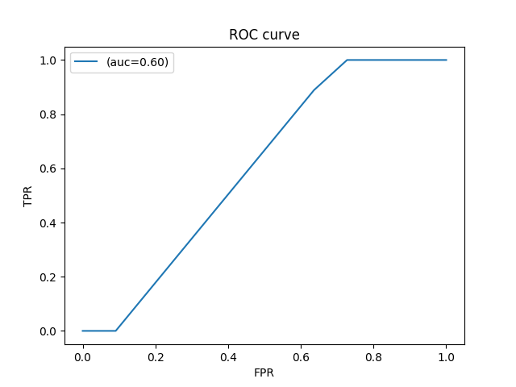
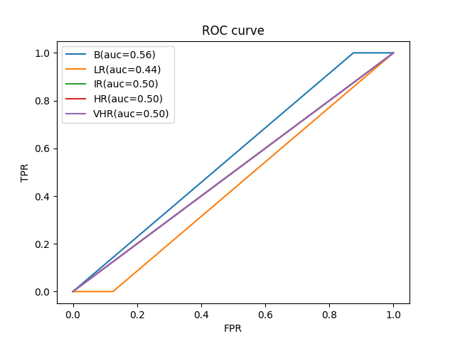

# Task 1 - adjuvant treatment candidacy classification
AUC: 0.601 [0.409-0.793]
## ROC Curve
 

 

# Task 2 - risk categories classification
AUC: 0.500 [0.500-0.500]
## Multi-Class AUC

| AUC | AUC-BVsRest | AUC-LRVsRest | AUC-IRVsRest | AUC-HRVsRest | AUC-VHRVsRest |
| ------ | ------ | ------ | ------ | ------ | ------ |
| 0.500 [0.500-0.500] | 0.562 [0.500-0.625] | 0.438 [0.375-0.500] | 0.500 [0.500-0.500] | 0.500 [0.500-0.500] | 0.500 [0.500-0.500] |
## ROC Curve
 

 
