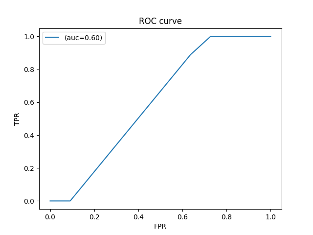
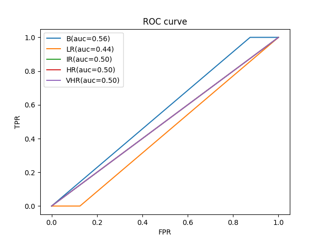

# Task 1 - adjuvant treatment candidacy classification
AUC: 0.60 [0.41-0.79]
## ROC Curve
 

 

# Task 2 - risk categories classification
AUC: 0.50 [0.50-0.50]
## Multi-Class AUC

| AUC | AUC-BVsRest | AUC-LRVsRest | AUC-IRVsRest | AUC-HRVsRest | AUC-VHRVsRest |
| ------ | ------ | ------ | ------ | ------ | ------ |
| 0.50 [0.50-0.50] | 0.56 [0.50-0.62] | 0.44 [0.38-0.50] | 0.50 [0.50-0.50] | 0.50 [0.50-0.50] | 0.50 [0.50-0.50] |
## ROC Curve
 

 
