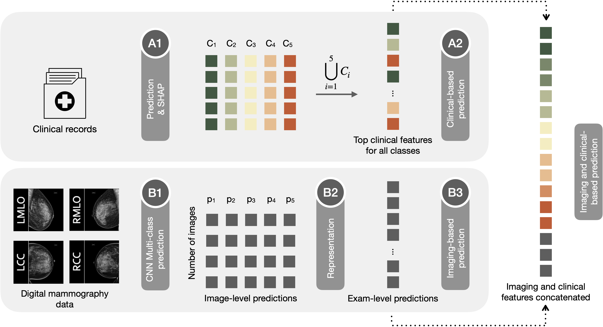

# Virtual Biopsy Derived Using AI-based Multimodal Modeling of Binational Breast Mammography Data

## About

This repository is an implementation of Virtual Biopsy, an AI-based model trained on digital mammography (DM) and linked electronic health records to classify biopsied breast lesions. In the paper, a model that combines convolutional neural networks (CNN) with classic supervised learning algorithms was independently trained on DM from 2,120/1,642 women in Israel and the USA to predict breast lesion malignancy, obtaining an AUC on the held-out sets of 0.88 (0.85, 0.91) and 0.80 (0.74, 0.85), respectively. In the breast lesion subtype prediction, the best performing algorithms obtained AUC of 0.85 (0.82, 0.89) for ductal carcinoma in situ (DCIS), 0.76 (0.72, 0.83) for invasive leasions and 0.82 (0.77, 0.87) for benign lesions.

Since the DM datasets from the original paper are not publicly available, in this repository we provide the exact implementation details of Virtual Biopsy using a different dataset called [KNIGHT](https://github.com/neheller/KNIGHT). Although KNIGHT consists of Computed Tomography (CT) imaging of the kidneys, it includes additional rich clinical information of the patients. Additionally, it contains five risk classification labels and the patients can be divided into two classes based on the follow-up treatment. Therefore, it is an ideal dataset that fits our technology and illustrates three important components of the Virtual Biopsy workflow: (i) integration of medical images with clinical data, (ii) binary classification of malignant vs. benign and (iii) breast lesion subtype classification. The approach used with the KNIGHT dataset was the same used for the DM dataset. The workflow below is explained in detail in the jupyter notebook ```virtual_biopsy_workflow.ipynb```.




## Installing Dependencies

Virtual Biopsy is based on [FuseMedML](https://github.com/IBM/fuse-med-ml) framework and is tested on Python >= 3.7 (3.7 is recommended) and PyTorch >= 1.5.

- Install [Conda](https://www.anaconda.com/blog/moving-conda-environments)
- Clone the [fuse-med-ml repository](https://github.com/IBM/fuse-med-ml/tree/virtual_biopsy_ensemble_methods)

```
git clone git@github.com:IBM/fuse-med-ml.git
```
- Change directories to fuse-med-ml:

```
cd fuse-med-ml
```

- Switch to a different branch:

```
git checkout virtual_biopsy_ensemble_methods
```

- Create a conda environment using the following command (you can replace FUSEMEDML with your preferred environment name)

```
    conda create -n FUSEMEDML python=3.7
    conda activate FUSEMEDML
```

- Install from source in an [editable mode](https://pip.pypa.io/en/stable/topics/local-project-installs/#editable-installs) using ```pip```:

```
pip install -e .
```

## Download the data

- Clone the official [KNIGHT database repository](https://github.com/neheller/KNIGHT).
- A JSON file with each patient's clinical data is located under `knight/data/knight.json`. The imaging associated with each of the 300 patients needs to be downloaded with the `knight/scripts/get_imaging.py` script (requires Python 3).
- ```cd``` into ```KNIGHT``` and run ```python knight/scripts/get_imaging.py``` to download the images.

## About the data

In the KNIGHT data, the patients are classified into five risk categories in accordance with American Urological Association (AUA) guidelines. The attribute entitled `"aua_risk_group"` in the `knight.json` file contains the risk groups `"benign"`, `"low_risk"`, `"intermediate_risk"`, `"high_risk"` and `"very_high_risk"`. These groups can be divided into two classes based on the follow-up treatment: `"high_risk"` and `"very_high_risk"` patients are eligible for adjuvant therapy (`adj_therapy = 1`), whereas `"benign"`, `"low_risk"`, and `"intermediate_risk"` are not (`adj_therapy = 0`). The primary task is a binary patient classification as per the follow-up treatment, and the secondary task is a fine-grained classification into five risk groups. These labels are similar to our original DM dataset, where we perform binary classification between  malignant (`"DCIS"` and "`invasive"`) versus benign breast lesions (`"benign"`, `"high-risk lesions"` and `"others"`). Thus, task 1 is referred as `"cancer vs. non-cancer"` classification in our paper, and task 2 is equivalent to the breast lesion subtype classification.

## Steps to run the DL model

1. Once you cloned the KNIGHT database repository (which should now contain the imaging and clinical data under ```knight/data```), you need to update the ```data_path``` variable inside the ```CNN_example.py``` script (line 338) to be your local path where the images are stored (e.g. ```~/VirtualBiopsy/KNIGHT```)

2. Now you can run the the ```CNN_example.py``` script which trains and evaluates the DL model on the images:

```
cd fuse_examples/classification/virtual_biopsy_ensemble_methods/
python cnn_example.py
```

If you only want to evaluate Task 1, you may redefine ```task_loop = [1]``` in line 257 of ```CNN_example.py```. Running only Task 2 is not possible since the pre-trained weights from Task 1 are used in the second task.

*Important Note:* Once you run ```CNN_example.py``` for the first time, it will perform caching of the data and store the cached data in the ```knight_cache``` folder. The next time you run ```CNN_example.py```, it will skip this process, and use the existing, already cached data. You need to be aware of this, because if you want to modify anything related to the data (for example, the ```resize_to``` parameter), then you will need to manually delete the contents of ```knight_cache``` folder, to allow the caching process to take place again with the new parameters.
